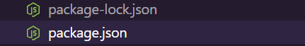
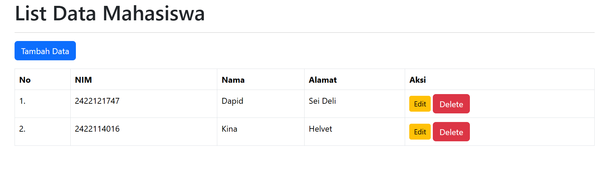
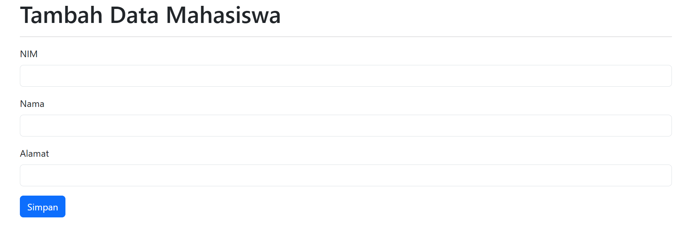
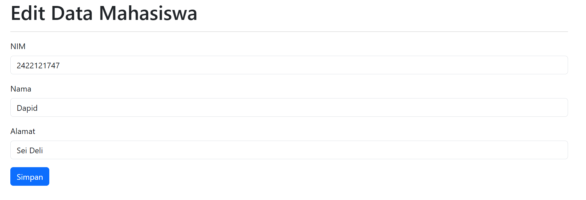
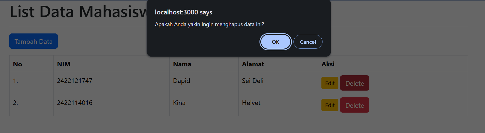

# Lelah dengan Metode Pengelolaan Data Konvensional? Bagaimana jika Kamu Menciptakan **Pengelola Data**mu Sendiri?

[Aku tiba-tiba ingin kembali ke halaman utama](./index.md)

---


Mengelola data secara manual memang melelahkan, belum lagi menghadapi potensi kesalahan yang tidak terhindarkan karena pada akhirnya kita hanya manusia biasa. Tetapi tidak perlu khawatir! Hari ini kamu akan dibimbing untuk menciptakan satu aplikasi sederhana yang berjalan di Web untuk membantu kamu mengelola data dengan lebih praktis. Sebelum kita mulai, kita lihat dulu apa saja yang akan kita lakukan dari awal sampai aplikasi kamu siap untuk diluncurkan!

## *Alur Pengerjaan*

1. [Siapkan Environmentmu](#siapkan-environmentmu)
2. [Ciptakan Kerangka Tampilan yang Menarik](#ciptakan-kerangka-tampilan-yang-menarik)
3. [Node.js dan Inisiasi Project](#nodejs-dan-inisiasi-project)
4. [Express - Biarkan Servermu Hidup](#express---biarkan-servermu-hidup)
5. [Handlebars - Sang Middleware](#handlebars---sang-middleware)
6. [SQLite3 - Gudang Penyimpanan Data](#sqlite3---gudang-penyimpanan-data)
7. [Fungsi CRUD - Raja Terakhir Pengelolaan Data yang Kejam](#fungsi-crud---raja-terakhir-pengelolaan-data-yang-kejam)
8. [Menjalankan dan Mengunjungi Server](#menjalankan-dan-mengunjungi-server)

Kamu sudah siap meluncur? Siap tidak siap, mari!

## Siapkan Environmentmu

[Aku ingin berpindah ke alur lainnya](#alur-pengerjaan)

---

Sebelum kamu memasak, kamu perlu alat masaknya terlebih dahulu. Begitu juga kalau ingin membuat aplikasi ini, kamu butuh environment pengerjaan yang tepat. Aku menyarankan kamu untuk menggunakan:

### Visual Studio Code

The **GOAT** of Programming IDE. Kamu bisa menuliskan program kamu di sini, menjalankan program kamu pakai terminal yang ada di dalamnya, dan menggunakan berbagai ekstensi yang akan sangat membantu pengerjaan kamu!

```javascript
visual studio code adalah favorit saya juga. saya sudah menggunakannya bertahun-tahun, bahkan sejak saya hanya bisa mengetikkan "Hello World" tanpa mengerti bagaimana menampilkannya ke layar.
```

### Git & GitHub

Platform yang tidak kalah **GOAT** dari Visual Studio Code. Dengan ini kamu bisa terhubung langsung dengan project kamu untuk menyimpan setiap track pengerjaanmu, berkolaborasi dengan banyak programmer lain yang tidak kalah hebatnya dengan kamu, juga mencari inspirasi melalui ruang open-source yang tidak terbatas!

`sebenernya yang ini sih ga perlu banget ya, izinn. i mean kalau gunainnya pinter, ini sih berguna banget, tapi dibilang necessary buat projectmu kali ini? ngga juga sih, toh kamu lebih perlu layanan hosting untuk server webmu, cuma yah aku belum tau banyak, jadi habis ini semangat cari tempat buat hosting webnya yah.`

## Ciptakan Kerangka Tampilan yang Menarik

[Aku ingin berpindah ke alur lainnya](#alur-pengerjaan)

---

Semua hal yang berfungsi juga pernah melalui proses perancangan dulu kok. Kamu tidak perlu terburu-buru langsung mencari cara gimana supaya aplikasimu berfungsi, toh semuanya percuma kalau kerangkanya tidak dirancang dengan baik. Kamu bisa mulai rancang kerangka tampilannya menggunakan Markup Language yang paling sederhana di semesta, yaitu **HTML**. Kamu bisa menggunakan HTML, kan? Lalu kamu bisa menggunakan **CSS** untuk memberi sedikit ataupun banyak warna dan gaya pada tampilanmu, dan mungkin kamu bisa sedikit lebih liar lagi dengan menyertakan **Javascript** untuk menghasilkan tampilan yang lebih interaktif, tapi sepertinya yang itu tidak begitu perlu untuk sekarang ini, lagipula kita akan banyak berurusan dengan Javascript selama pengerjaan fungsi webnya nanti, jadi untuk apa menceburkan diri ke laut dalam tanpa ada harta karun yang harus kamu cari :)

`kepikiran dari mana coba peribahasa yang begitu, lagian emang itu peribahasa?`

> Sepertinya kita harus memberi contoh tampilan sederhana yang bisa memancing ide-idenya

```javascript
saya setuju, berikut contoh kode HTML untuk tampilan sederhana yang mungkin kamu butuhkan.
```

```HTML
<!DOCTYPE html>
<html lang="en">
<head>
    <meta charset="UTF-8">
    <meta name="viewport" content="width=device-width, initial-scale=1.0">
    <title>Program Input Data Mahasiswa</title>
    <link href="https://cdn.jsdelivr.net/npm/bootstrap@5.3.8/dist/css/bootstrap.min.css" rel="stylesheet" integrity="sha384-sRIl4kxILFvY47J16cr9ZwB07vP4J8+LH7qKQnuqkuIAvNWLzeN8tE5YBujZqJLB" crossorigin="anonymous">
</head>
<body>
    <div class="container">
        <h1>Tambah Data Mahasiswa</h1>
        <hr>
        <form action="/mahasiswa/add" method="POST">
            <div class="mb-3">
                <label for="nim" class="form-label">NIM</label>
                <input type="text" class="form-control" id="nim" name="nim" required>
            </div>
            <div class="mb-3">
                <label for="nama" class="form-label">Nama</label>
                <input type="text" class="form-control" id="nama" name="nama" required>
            </div>
            <div class="mb-3">
                <label for="alamat" class="form-label">Alamat</label>
                <input type="text" class="form-control" id="alamat" name="alamat" required>
            </div>
            <button type="submit" class="btn btn-primary">Simpan</button>
        </form>
    </div>
</body>
</html>
```

Benar, kamu pasti punya banyak pertanyaan tentang secarik kode "sederhana" ini. Sayangnya tidak semua pertanyaan kamu bisa terjawab sekarang karena keterbatasan budget pembuatan tutorial ini, namun pertanyaan-pertanyaan penting akan mendapatkan keadilan yang pantas mereka dapatkan.

> Aku yakin kamu pasti bertanya tentang CSS. "Apakah aku perlu membuat CSS sendiri lagi?", maka bergembiralah temanku, sebab kamu **tidak** perlu melakukannya. Mengapa demikian? Kita akan sedikit berbicara tentang salah satu library CSS terbaik saat ini, yaitu **Bootstrap**.

```javascript
saya rasa kita tidak perlu membahasnya secara spesifik. bootstrap adalah sebuah library yang menyimpan banyak, benar-benar banyak sekali komponen CSS yang bisa anda gunakan berulang-ulang, langsung di baris HTML anda, serta tanpa penulisan sintaks yang memusingkan. lalu di mana letak bootstrap pada kode HTML sebelumnya? perhatikan kembali:
```

```javascript
<link href="https://cdn.jsdelivr.net/npm/bootstrap@5.3.8/dist/css/bootstrap.min.css" rel="stylesheet"
```

```javascript
sudah ketemu? pandai sekali. benar, satu baris perintah <link> itu adalah segala yang anda perlukan untuk mulai menggunakan bootstrap. mereka benar-benar orang baik karena telah menciptakan alat bantu sekaligus panduannya sebagus ini.
```

> Semoga kamu mengerti dengan penjelasan yang sangat singkat itu! Penggunaan perintah-perintah dan komponen tertentu secara lengkapnya bisa kamu baca pada [halaman dokumentasi resmi bootstrap](https://getbootstrap.com/docs/4.1/getting-started/introduction/). Selamat melanjutkan!

Kamu sudah mendapatkan sedikit wawasan tambahan tentang cara mudah menghadirkan CSS ke dalam kerangka HTML kamu. Sekarang karena kamu sudah siap dengan kerangka tampilannya, kita bisa masuk pada bagian seriusnya!

`bentar deh, me izin merincikan sedikit yah. kita mau buat aplikasi pengelolaan data nih, artinya kita butuh beberapa tampilan deh at least. contohnya, tampilan utama, bisa dinamain index aja biar simple, terus ada tampilan buat tambahin datanya sama edit datanya, jangan lupa siapkan tampilan itu dulu ya baru lanjut. oke good luck!`

## Node.js dan Inisiasi Project

[Aku ingin berpindah ke alur lainnya](#alur-pengerjaan)

---

Kita sudah memasuki bagian yang serius dari project kamu saat ini. Mulai detik ini candaan akan berkurang dengan signifikan, dan kita akan berfokus pada pengerjaan project kamu hingga selesai. Kamu paham? Bagus, saatnya kita berkenalan dengan **Node.js**.

Sejujurnya kita tidak punya begitu banyak waktu untuk berkenalan dengan benda ajaib ini, namun baiklah. Node.js adalah *Runtime Environment* Javascript yang bersifat open-source, dijalankan secara server-side, memanfaatkan engine V8 yang juga digunakan oleh Google Chrome, dan masih banyak lagi keunggulan lainnya. Yang paling penting, Node.js adalah senjata utama kita dalam menyelesaikan project sederhana kali ini. Oleh karena itu, sudah saatnya kamu membuka browser kamu, apapun jenisnya, dan menginstall Node.js tanpa membuang lebih banyak waktu lagi.

> Biar kubantu! Kamu bisa mendapatkannya [di sini](https://nodejs.org/id). Lalu agar kamu tidak kesulitan berurusan dengan hal-hal yang belum kamu mengerti, kamu bisa langsung memilih untuk mengunduh versi **Penginstal Windows** dengan ekstensi *.msi*, percayalah itu tidak sulit. Oh iya, kalau kamu tidak menggunakan Windows, kamu juga bisa mengganti pilihan OS kamu dan mengunduh penginstal yang sesuai. Semoga beruntung!

Setelah kamu menginstall dan memastikan Node.js kamu sudah siap untuk berperang, kini saatnya kita meresmikan sebuah armada baru untuk menciptakan aplikasi yang kita inginkan, dalam istilah pemrograman kita perlu "menginisiasi Node.js" agar kita mampu mulai mengerjakan project ini. Apakah kamu siap? Siap tidak siap, nyatakan perintah ini di terminal kamu.

> Tunggu! Jangan lupa untuk menginisiasinya di folder yang tepat! Jangan sampai kamu tidak bisa menemukan markas armada kamu sendiri! Sekarang, jika folder tempat pengerjaan kamu sudah sesuai, ketikkan ini di terminal kamu!

```javascript
npm init -y
```

```javascript
biar saya yang menjawab pertanyaan anda.
npm -> node package manager
init -> inisiasi
-y -> menyatakan "yes" secara automatis pada pertanyaan-pertanyaan konfirmasi yang tersedia
```

`mana tau masi bingung, perintah npm init itu kita declare untuk memulai project Node kita, nantinya bakal terbentuk folder baru bernama` **node_modules** `di folder project kamu, dan juga bakal ada 1 atau 2 file json yang memuat data-data mengenai project kamu.`




Kamu tidak perlu memedulikan `package-lock.json`, kamu hanya akan perlu berurusan dengan `package.json` nantinya.

Kamu sudah selesai inisiasi, sekarang kamu perlu sebuah "titik tetap" yang menjadi pusat dari pengerjaan projectmu. Ya, kamu akan perlu satu file Javascript yang memuat berbagai perintah untuk menjalankan server kamu nanti. Maka dari itu, buat satu file baru bernama `index.js`.


Sekarang kita akan berkutat di dalam satu file spesifik ini, mari tidak membuang-buang waktu dan mulai bergerak cepat!

`cuma perasaanku atau emang kita makin dramatis dan buru-buru nih?`

```javascript
sepertinya bukan hanya perasaanmu.
```

## Express - Biarkan Servermu Hidup

[Aku ingin berpindah ke alur lainnya](#alur-pengerjaan)

---

Kita akan mulai memanfaatkan satu per satu "pasukan" yang dimiliki oleh Node.js. Pertama, kita butuh server untuk menjalankan aplikasi kita. Untuk menangani hal itu, **Express.js** siap melayani kita.

> Hai, kamu sudah berprogres cukup jauh! Sekarang kita akan menginstall Express.js yang merupakan salah satu dari sekian banyaknya *Node Modules*, sekadar informasi sederhana untuk kamu, Express.js adalah salah satu Framework Javascript yang dikenal akan kekayaan fitur dan kepraktisan penggunaannya. Kamu akan lebih mengerti jika mencobanya sendiri, jadi mari install terlebih dahulu di terminal serba guna kamu!

```javascript
npm install express
```

> Jika proses installnya sudah selesai, kamu boleh buka file index.js yang masih kosong tadi, lalu masukkan beberapa kode di bawah ini!

```javascript
const express = require('express');

const app = express();

app.listen(3000, () => {
    console.log("Server is running on https://localhost:3000");
});
```

```javascript
persilakan saya menjelaskan sedikit.

perintah require('express') memanggil module express.js yang telah anda unduh sebelumnya dan menyimpannya dalam konstanta "express".

perintah express() mengaktifkan server expressmu dan menyimpannya ke dalam konstanta "app". nantinya anda akan menggunakan konstanta "app" ini untuk melakukan banyak hal dengan server expressmu.

perintah app.listen menjalankan servermu di port yang telah ditentukan (dalam hal ini adalah port 3000), lalu mengeluarkan output di console sebagai konfirmasi bahwa server anda telah berjalan di port yang ditentukan.

semoga bermanfaat.
```

Kode di atas adalah awalan paling sederhana untuk mengaktifkan servermu menggunakan Express.js, lalu bagaimana selanjutnya? Kita masih berurusan dengan Express.js, namun kali ini kita akan mengenal istilah **Routing**.

> Sama seperti kita manusia, server juga butuh arah yang jelas untuk menampilkan konten yang sesuai dengan request. Supaya server tidak kebingungan ingin menampilkan apa, maka kita harus mendefinisikan "rute" dengan jelas. Rute dalam hal ini juga berkaitan dengan aktivitas apa yang hendak dilakukan oleh server, entah itu membaca informasi, meletakkan informasi, atau menghapus informasi, semua itu terlaksana melalui perintah-perintah di bawah ini.

```javascript
app.get('rute tujuan', (req, res) => {
    // apa yang harus dibaca server
});
```

```javascript
app.post('rute tujuan', (req, res) => {
    // apa yang harus dipost server (bisa post, bisa edit, bisa delete juga)
});
```
Server akan mengenali rute tujuannya dan menjalankan perintah yang sudah didefinisikan sebelumnya. Sesederhana itu, selanjutnya kita bisa memerintahkan server untuk menampilkan file-file HTML yang sudah kamu kerjakan sebelumnya, contohnya:

```javascript
app.get('/', (req, res) => {
    res.send("index.html");
})
```
dan ya, halaman HTML kamu akan muncul saat kamu menjalankan servernya.

Namun yang menjadi pertanyaan, apakah hanya itu hasil akhir yang kamu inginkan? Bukankah kamu mendambakan hasil yang lebih hebat, yang bisa benar-benar kamu banggakan?

Aku bercanda, memang benar halaman HTML kamu sudah bisa ditampilkan, namun tidak ada yang bisa kita lakukan selain membukanya, menatapnya, lalu menutupnya. Target kita adalah menciptakan sebuah aplikasi yang bisa menampilkan data, menyediakan fitur untuk menambahkan dan mengedit data, serta terakhir, menghapus data, oiya tidak lupa juga menyimpan data ke Database, karena jika tidak, data kamu bisa menghilang hanya dalam satu klik tombol Refresh pada browser.

## Handlebars - Sang Middleware

[Aku ingin berpindah ke alur lainnya](#alur-pengerjaan)

---

Selanjutnya kita perlu menyesuaikan tampilan HTML kita dengan adanya kehadiran Express.js yang sudah kita manfaatkan sebelumnya. Perlu kamu ketahui, HTML yang kamu miliki saat ini masih bersifat statis. Artinya, segala sesuatu di dalamnya memiliki nilai mati yang tidak akan berubah tanpa melakukan perubahan pada kode sumbernya sendiri. Ini tidak terdengar baik untuk target aplikasi kita yang semestinya mampu menghadapi dinamika perubahan data. Oleh karena itu, kita perlu sebuah "perantara" yang telah disediakan oleh Express.js untuk mengatasinya, saatnya kamu menginstall:

```javascript
npm install express-handlebars
```

```javascript
benar, handlebars adalah sebuah middleware, atau mungkin anda lebih mengenalnya sebagai penengah, atau perantara, yang tugasnya memanipulasi kode HTML anda menjadi dinamis dan terbuka untuk kemungkinan fitur-fitur lainnya, berkat adanya kehadiran handlebars.
```

Kamu akan memerlukan kode-kode di bawah ini untuk memastikan handlebars kamu siap untuk digunakan.

```javascript
const { engine } = require('express-handlebars');
const path = require('path');

const hbs = engine({
    extname: 'hbs',
    defaultLayout: 'main',
    layoutsDir: path.join(__dirname, 'views', 'layouts'),
    helpers: {
        noUrut: (index) => index + 1
    }
});

app.engine('hbs', hbs);
app.set('view engine', 'hbs');
app.set('views', path.join(__dirname, 'views'));
```

> Jangan panik! Mungkin itu terlihat memusingkan tapi tenang, aku akan membuatnya terlihat sederhana untuk kamu!

> Sama seperti Express.js sebelumnya, kita perlu memanggil modul yang bersangkutan agar dapat digunakan. Setelah itu, ada sejumlah hal yang harus kita konfigurasi, seperti nama ekstensi file yang akan ditampilkan (dalam hal ini kita jadikan .hbs), layout utama yang akan digunakan, lokasi layout di direktori, fungsi helpers, ya ini terlalu banyak, biarkan aku membagi-baginya dalam beberapa bagian!

### extname

> Mendefinisikan ekstensi file yang akan dijalankan server sesuai routing yang ditentukan, dalam hal ini kita menggunakan ekstensi hbs (.hbs) karena file-file yang tadinya berupa HTML, akan kita "konversi" menjadi file dengan format hbs.

### defaultLayout

> Salah satu keajaiban dari handlebars, yaitu menyingkat kode HTML dengan template Layout. Bagian defaultLayout ini sekadar mendefinisikan layout utama yang digunakan untuk semua file HTML (atau hbs).

### layoutsDir

> Sesederhana memberitahu direktori mana yang menyimpan kumpulan layouts kamu.

### Path

> Sebuah fungsi tambahan untuk mendefinisikan jalur direktori kamu di perintah-perintah tertentu, kita menggunakan ini agar tidak terjadi bentrok pendefinisian path direktori untuk OS yang berbeda.

### Fungsi Helpers

> Cara kerjanya seperti Function biasa pada Javascript, di sini berperan sebagai Function pembantu yang dapat digunakan nantinya bila dipanggil dengan sintaks yang sesuai.

Sepertinya kamu sudah mempelajari bagaimana konfigurasi handlebars bekerja pada project kamu, ada sedikit lagi, kita akan belajar bagaimana membuat file HTML kamu menjadi lebih ringkas dan sederhana.

### Mengganti ekstensi .html menjadi .hbs

Fitur handlebars tidak akan bisa bekerja di dalam file yang masih memegang ekstensi .html!

### Mempersingkat kodemu

Bayangkan setiap kodemu memiliki baris-baris yang cenderung sama. Untuk menghindari hal tersebut, handlebars memperkenalkan **Layout**, dan fitur ini sangat membantumu dalam menciptakan kode HTML yang lebih clean dan praktis.

> Benar sekali! Ini sebelum kamu menggunakan handlebars:

```HTML
<!DOCTYPE html>
<html lang="en">
<head>
    <meta charset="UTF-8">
    <meta name="viewport" content="width=device-width, initial-scale=1.0">
    <title>Program Input Data Mahasiswa</title>
    <link href="https://cdn.jsdelivr.net/npm/bootstrap@5.3.8/dist/css/bootstrap.min.css" rel="stylesheet" integrity="sha384-sRIl4kxILFvY47J16cr9ZwB07vP4J8+LH7qKQnuqkuIAvNWLzeN8tE5YBujZqJLB" crossorigin="anonymous">
</head>
<body>
    <div class="container">
        <h1>Tambah Data Mahasiswa</h1>
        <hr>
        <form action="/mahasiswa/add" method="POST">
            <div class="mb-3">
                <label for="nim" class="form-label">NIM</label>
                <input type="text" class="form-control" id="nim" name="nim" required>
            </div>
            <div class="mb-3">
                <label for="nama" class="form-label">Nama</label>
                <input type="text" class="form-control" id="nama" name="nama" required>
            </div>
            <div class="mb-3">
                <label for="alamat" class="form-label">Alamat</label>
                <input type="text" class="form-control" id="alamat" name="alamat" required>
            </div>
            <button type="submit" class="btn btn-primary">Simpan</button>
        </form>
    </div>
</body>
</html>
```

> Dan ini kodemu setelah menggunakan handlebars:

```HTML
<h1>Tambah Data Mahasiswa</h1>
<hr>
<form action="/mahasiswa/add" method="POST">
    <div class="mb-3">
        <label for="nim" class="form-label">NIM</label>
        <input type="text" class="form-control" id="nim" name="nim" required>
    </div>
    <div class="mb-3">
        <label for="nama" class="form-label">Nama</label>
        <input type="text" class="form-control" id="nama" name="nama" required>
    </div>
    <div class="mb-3">
        <label for="alamat" class="form-label">Alamat</label>
        <input type="text" class="form-control" id="alamat" name="alamat" required>
    </div>
    <button type="submit" class="btn btn-primary">Simpan</button>
</form>
```

> Lalu ke mana sisa kodenya pergi? Sisa kodenya pergi ke file Layout yang hanya perlu 1 dan bisa digunakan sebagai template untuk banyak file HTML sekaligus!

```HBS
<!DOCTYPE html>
<html lang="en">
<head>
    <meta charset="UTF-8">
    <meta name="viewport" content="width=device-width, initial-scale=1.0">
    <title>Program Input Data Mahasiswa</title>
    <link href="https://cdn.jsdelivr.net/npm/bootstrap@5.3.8/dist/css/bootstrap.min.css" rel="stylesheet" integrity="sha384-sRIl4kxILFvY47J16cr9ZwB07vP4J8+LH7qKQnuqkuIAvNWLzeN8tE5YBujZqJLB" crossorigin="anonymous">
</head>
<body>
    <div class="container">
        {{{body}}}
    </div>
</body>
</html>
```

> Kode-kodemu di file lainnya akan mengisi bagian `{{{body}}}` yang bisa kamu lihat di atas. Ya, itu adalah salah satu sintaks handlebars, cukup sederhana bukan?

### Memanfaatkan fungsi handlebars untuk data yang dinamis

Setelah ini kita akan menggunakan fungsi sederhana handlebars untuk mengisi halaman HTML dengan data yang dinamis, namun data yang dinamis tersebut lebih efektif jika diterapkan menggunakan *Database*. Maka dari itu, kita akan berkenalan dengan **SQLite3**.

## SQLite3 - Gudang Penyimpanan Data

[Aku ingin berpindah ke alur lainnya](#alur-pengerjaan)

---

Data yang dinamis membutuhkan wadah agar tidak binasa akibat ketidaksengajaan merefresh halaman di browser. Kita akan menggunakan sebuah layanan database sederhana bernama **SQLite3**.

```javascript
npm install better-sqlite3
```

Setelah kamu install, kamu harus menginisiasinya di dalam file `index.js` milikmu dan membuat database pertamamu untuk projectmu satu ini.

```javascript
const DB = require('better-sqlite3');
const db = new DB('mahasiswa.db');

db.exec(`
    CREATE TABLE IF NOT EXISTS mahasiswa (
        nim TEXT PRIMARY KEY,
        nama TEXT NOT NULL,
        alamat TEXT NOT NULL
    )
`);
```

`Okeh, kira-kira alurnya kayak gini:` <br>
`panggil modul -> buat Database baru -> eksekusi perintah di Database untuk membuat tabel baru`

Setelah memiliki Database yang bekerja dengan baik, kamu sudah bisa bekerja dengan data yang dinamis, kamu bisa memerintahkan server untuk membaca data dari Database dan menampilkannya, kamu bisa menambahkan data dan server akan mengirimnya ke Database, kamu juga bisa mengedit atau menghapus data, dan data tersebut akan turut terpengaruh di Database yang terhubung. Setelah ini kita memasuki tahap akhir, yaitu memaksimalkan fungsi CRUD (Create, Read, Update, Delete) dalam aplikasi kamu.

## Fungsi CRUD - Raja Terakhir Pengelolaan Data yang Kejam

[Aku ingin berpindah ke alur lainnya](#alur-pengerjaan)

---

Tanpa berpanjang-panjang, kita akan memanfaatkan semua pasukan yang telah kita pelajari hingga saat ini, mulai dari **Express.js** sang panglima itu sendiri, **Handlebars** sang tangan kanan dari Express, serta **SQLite3** sang penyimpan segala jenis senjata yang dibutuhkan untuk menghadapi musuh terkuat kita, fungsi CRUD yang maksimal.

Pertama, kita akan memaksimalkan fungsi pembacaan data, fungsi paling dasar dalam pengelolaan data. Kita hanya perlu memerintahkan server untuk membaca data dari Database dan menampilkannya. Dalam hal menampilkan, kita juga berbicara tentang menampilkan tampilan halaman yang sesuai. Tidak sesederhana itu, namun dengan segala hal yang sudah dipelajari sejauh ini, hal itu tidak mustahil untuk dipahami.

```javascript
app.get('/', (req, res) => {
    const mahasiswa = db.prepare('SELECT * FROM mahasiswa').all();
    res.render('index', {
        mahasiswa
    });
});

app.get('/mahasiswa/add', (req, res) => {
    res.render('mahasiswa/add');
});

app.get('/mahasiswa/edit/:nim', (req, res) => {
    const { nim } = req.params;

    const mahasiswa = db.prepare('SELECT * FROM mahasiswa WHERE nim = ?')
        .get(nim);

    res.render('mahasiswa/edit', {
        mahasiswa
    });
});
```

> Singkatnya, kamu mendefinisikan perintah kepada server untuk masing-masing aktivitas yang dapat terjadi, yaitu ketika kamu membuka halaman utama, membuka halaman tambah data, dan membuka halaman edit. Server akan memastikan data tampil dengan tepat saat kamu buka halaman utama, demikian juga server menampilkan data yang tepat saat kamu membuka halaman edit, kamu tidak akan mau mengedit data yang salah, bukan?

```javascript
sebuah tambahan agar dirimu semakin tangguh, untuk menampilkan data yang sudah ada ketika anda membuka halaman edit, anda akan membutuhkan sedikit tambahan module:

const bodyParser = require('body-parser');

app.use(bodyParser.urlencoded({ extended: false }));
```

```javascript
dengan demikian, halaman editmu akan menampilkan data yang sesuai dengan parameter.

selamat berjuang, pahlawan.
```

Selanjutnya, kamu harus bisa menambahkan data ke dalam aplikasi kamu.

```javascript
app.post('/mahasiswa/add', (req, res) => {
    const { nim, nama, alamat } = req.body;

    db.prepare(`INSERT INTO mahasiswa (nim, nama, alamat)
            VALUES (?, ?, ?)`)
        .run(nim, nama, alamat);
    
    res.redirect('/');
});
```

Lalu kamu juga harus bisa mengedit data kamu yang sudah ditambahkan sebelumnya dan mengupdatenya ke dalam Database.

```javascript
app.post('/mahasiswa/edit/:nim', (req, res) => {
    const { nim } = req.params;
    const { nama, alamat } = req.body;

    db.prepare('UPDATE mahasiswa SET nama = ?, alamat = ? WHERE nim = ?')
        .run(nama, alamat, nim);
    
    res.redirect('/');
});
```

Dan terakhir, kamu harus bisa menghapus data yang tidak berguna!

```javascript
app.post('/mahasiswa/delete/:nim', (req, res) => {
    const { nim } = req.params;

    db.prepare('DELETE FROM mahasiswa WHERE nim = ?')
        .run(nim);
    
    res.redirect('/');
});
```

> Hei.. sepertinya kita melaju terlalu cepat. Tarik nafasmu kawan, kamu diperbolehkan mengulangi langkah yang belum kamu pahami.

Tidak bisa. Kita harus lanjut ke langkah selanjutnya. Project ini harus segera selesai. Sekarang, ubah semua file .hbs mu menjadi kode di bawah ini!

`index.hbs`

```HBS
<h1>List Data Mahasiswa</h1>
<hr>
<a href="/mahasiswa/add" class="btn btn-primary mb-3">Tambah Data</a>
<table class="table table-bordered">
    <thead>
        <tr>
            <th>No</th>
            <th>NIM</th>
            <th>Nama</th>
            <th>Alamat</th>
            <th>Aksi</th>
        </tr>
    </thead>
    <tbody>
        {{#each mahasiswa}}
        <tr>
            <td>{{noUrut @index}}.</td>
            <td>{{this.nim}}</td>
            <td>{{this.nama}}</td>
            <td>{{this.alamat}}</td>
            <td>
                <a href="/mahasiswa/edit/{{this.nim}}" class="btn btn-warning btn-sm">Edit</a>
                <form action="/mahasiswa/delete/{{this.nim}}" method="POST" style="display: inline-block;">
                    <button type="submit" class="btn btn-danger" onclick="return confirm('Apakah Anda yakin ingin menghapus data ini?')">Delete</button>
                </form>
            </td>
        </tr>
        {{/each}}
    </tbody>
</table>
```

`add.hbs`

```HBS
<h1>Tambah Data Mahasiswa</h1>
<hr>
<form action="/mahasiswa/add" method="POST">
    <div class="mb-3">
        <label for="nim" class="form-label">NIM</label>
        <input type="text" class="form-control" id="nim" name="nim" required>
    </div>
    <div class="mb-3">
        <label for="nama" class="form-label">Nama</label>
        <input type="text" class="form-control" id="nama" name="nama" required>
    </div>
    <div class="mb-3">
        <label for="alamat" class="form-label">Alamat</label>
        <input type="text" class="form-control" id="alamat" name="alamat" required>
    </div>
    <button type="submit" class="btn btn-primary">Simpan</button>
</form>
```

`edit.hbs`

```HBS
<h1>Edit Data Mahasiswa</h1>
<hr>
<form action="/mahasiswa/edit/{{mahasiswa.nim}}" method="POST">
    <div class="mb-3">
        <label for="nim" class="form-label">NIM</label>
        <input type="text" class="form-control" id="nim" name="nim" required value="{{mahasiswa.nim}}">
    </div>
    <div class="mb-3">
        <label for="nama" class="form-label">Nama</label>
        <input type="text" class="form-control" id="nama" name="nama" required value="{{mahasiswa.nama}}">
    </div>
    <div class="mb-3">
        <label for="alamat" class="form-label">Alamat</label>
        <input type="text" class="form-control" id="alamat" name="alamat" required value="{{mahasiswa.alamat}}">
    </div>
    <button type="submit" class="btn btn-primary">Simpan</button>
</form>
```

> BAIK CUKUP! KITA TERLALU TERBURU-BURU!

> Kamu pasti melihat banyak istilah yang tidak familiar, beberapa di antaranya sintaks SQL yang belum kamu kenali, mungkin seperti `SELECT`, `INSERT`, `UPDATE`, `DELETE`. Fungsinya sama seperti nama sintaksnya kok, **SELECT** untuk memilih data, **INSERT** untuk memasukkan data, **UPDATE** untuk mengganti data yang sudah ada dengan data baru, serta **DELETE** untuk menghapus data.

> Setelah itu kamu juga pasti sedikit kebingungan dengan sintaks Handlebars seperti `{{mahasiswa.nim}}`, `{{this.nama}}`, atau `{{#each}} {{/each}}`. Saat pertama kali melihatnya mungkin kamu pusing, namun percayalah, cara kerjanya tidak jauh berbeda dari sintaks Javascript pada umumnya.

```javascript
biar saya bantu dengan sebuah perbandingan.

- Handlebars
{{this.nama}} {{mahasiswa.nim}}
- Javascript
`${nama} ${mahasiswa.nim}`

- Handlebars
{{#each}} {{/each}}
- Javascript
forEach(... => {})
```

Sepertinya kamu sudah selesai berkutat dengan banyak hal.

SELAMAT! APLIKASI KAMU SUDAH SIAP UNTUK DIGUNAKAN DAN DIJALANKAN!

```javascript
... atau mungkin tidak. haruskah saya memberitahunya bahwa ia harus hosting terlebih dahulu, sepertinya biarkan dia berbangga diri sementara.
```

## Menjalankan dan Mengunjungi Server

[Aku ingin berpindah ke alur lainnya](#alur-pengerjaan)

---

Rasanya seperti kamu sudah terlibat dalam peperangan yang panjang sekali. Sekarang kamu sudah menang, kamu memperoleh apa yang kamu targetkan sejak permulaan. Saatnya aku membantumu untuk menjalankannya. Pertama, kamu perlu menginstall sebuah module sederhana ini dulu.

```javascript
npm install nodemon -D
```

> Bukannya ini lebih baik dikasih tau selama pengerjaan tadi ya..

```javascript
mengherankan. siapa yang akan memberitahunya jika nodemon bisa digunakan untuk menjalankan server dan mampu menyimpan perubahan tanpa harus menjalankan server kembali.
```

`yaudah si guys. lebih baik kalian kasi info tambahan deh. itu lihat ada -D di akhir perintahnya? itu buat memisahkan module nodemon khusus di bagian devDependencies doang, abis ini dijelasin kok.`

Setelah ini kamu bisa membuka file bernama `package.json` dan melihat daftar `Dependencies` serta `devDependencies`. Kedua daftar ini merupakan daftar module yang sudah kamu install, Dependencies adalah module yang tetap ikut serta hingga server dijalankan, sementara devDependencies adalah module yang hanya terlibat selama proses development, sehingga tidak ikut hingga server dijalankan dan tidak mengakibatkan server semakin berat.

Jika kamu sudah paham, kamu bisa menambahkan perintah ini ke bagian `"scripts"` di `package.json` kamu.

```javascript
"dev": "nodemon index.js"
```

Perintah ini bermaksud untuk memanfaatkan nodemon dalam menjalankan server kamu langsung menggunakan perintah npm, yaitu:

```javascript
npm run dev
```

> Untuk "dev" boleh kamu ganti jadi yang lain kok! Kayak "jalan", "run", atau apapun boleh deh.

Akhirnya, kamu sudah bisa menjalankan server kamu dengan perintah yang sebenarnya sudah disebutkan barusan,

```javascript
npm run dev
```

Dan... Selamat membuka port server kamu, dan selamat mencari layanan hosting yang terpercaya setelah ini. Maaf karena belum bisa memberikan rekomendasi hosting, semoga kamu cukup beruntung. Sampai jumpa di lain kesempatan!

Oh iya, berikut beberapa tampilan aplikasi yang kamu kerjakan sebagai gambaran apabila kamu benar-benar mengikuti instruksi dengan baik.






Dan juga ini adalah struktur project yang kita kerjakan sedaritadi.


> Terima kasih sudah menyempatkan waktu kamu di sini! Sampai jumpa!!

```javascript
terima kasih. semangat juangmu perlu diacungi jempol.
```

`tank bawa kayu, tankyu.`

[Kembali ke halaman utama](./index.md)