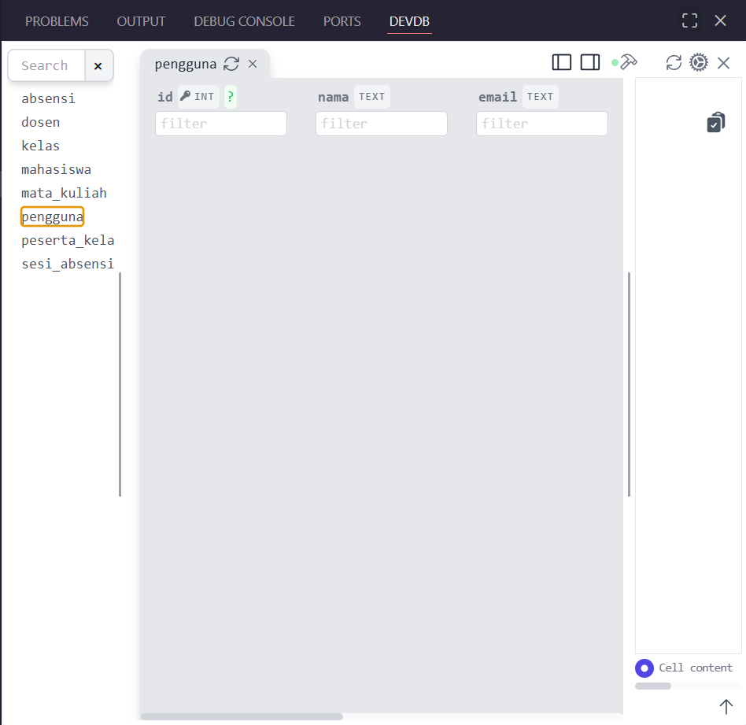

# Membuat Database SQLite Web Absensi dengan Node.js Menggunakan better-sqlite3


Sebuah web absensi tidak akan berfungsi dengan baik tanpa adanya Database untuk menyimpan data-data serta rekam jejak absensi. Kini SQLite telah hadir bersama Node.js melalui better-sqlite3 untuk mengintegrasikan website anda dengan Database yang praktis! Halaman ini akan menuntun anda dalam menciptakan database untuk web absensi anda hanya dengan ```node.js``` dan ```better-sqlite3```.

## Daftar Isi

1. [Mengapa Harus Menggunakan ```better-sqlite3```?](#mengapa-harus-menggunakan-better-sqlite3)
2. [Apa yang Harus Disiapkan?](#apa-yang-harus-disiapkan)
3. [Merancang Skema Database](#merancang-skema-database)
4. [Inisiasi Project dan Installing Module](#inisiasi-project-dan-installing-module)
5. [Penulisan Perintah SQLite di Project Node.js](#penulisan-perintah-sqlite-di-project-nodejs)
6. [Eksekusi Program Menjadi File Database](#eksekusi-program-menjadi-file-database)
7. [Akhir Kata](#akhir-kata)

### Extras

- [Kapan Menggunakan ```AUTOINCREMENT```?](#extra--kapan-menggunakan-autoincrement)
- [Menempa Fungsionalitas Foreign Key dengan ```ON UPDATE CASCADE``` dan ```ON DELETE CASCADE```](#extra--menempa-fungsionalitas-foreign-key-dengan-on-update-cascade-dan-on-delete-cascade)

## Mengapa Harus Menggunakan ```better-sqlite3```?

```better-sqlite3``` adalah SQL versi praktis yang mampu berintegrasi dengan ```node.js```. Pada dasarnya sintaks yang digunakan adalah sintaks ```SQLite``` secara umum, namun ```better-sqlite3``` diperuntukkan khusus pengembangan web menggunakan ```node.js```. Dengan demikian, website yang dibangun menggunakan ```node.js``` kini dapat diintegrasikan dengan sebuah database yang cukup praktis dan lebih ringan, memungkinkan peningkatan kinerja website yang signifikan.

Berikut beberapa perbedaan antara ```SQL``` dengan ```SQLite``` untuk membantu anda memahami fungsi dan konteks yang lebih sesuai untuk keduanya.

| Fitur | SQL (contoh: MySQL) | SQLite |
| :-: | :-: | :-: |
| Jenis | Bahasa Query | Software Database Relasional |
| Arsitektur | Perlu server terpisah | Tertanam dalam aplikasi (*embedded*) |
| Penyimpanan | Banyak file, perpindahan sulit | Satu file tunggal, perpindahan praktis |
| Konfigurasi | Memerlukan instalasi dan setup | *Zero-configuration* (cukup install module untuk integrasi dengan node.js) |
| Concurrency (Penggunaan bersamaan) | Bagus untuk banyak pengguna | Terbatas |
| Skalabilitas | Cocok untuk data yang besar | Disarankan hanya untuk data kecil hingga menengah |
| Keamanan | Hak akses yang terperinci | Hanya mengandalkan perizinan OS file |

Dengan demikian, ```SQLite``` menjadi pilihan yang direkomendasikan untuk project-project sederhana seperti project yang dikerjakan dengan ```node.js``` karena bekerja dengan lebih ringan, cepat, serta praktis. Sementara ```SQL``` menjadi pilihan yang tepat untuk skala pengerjaan yang lebih besar terutama pengembangan yang dilakukan banyak user secara *real-time*.

## Apa yang Harus Disiapkan?

Sama seperti pada aktivitas sebelumnya, anda akan memerlukan beberapa hal untuk disiapkan, antara lain:

🧷 **[Visual Studio Code](https://code.visualstudio.com/download)** - Code Editor yang akan anda gunakan untuk menuliskan program DBML skema database anda hingga program node.js untuk generate database anda nantinya.

🧷 **[Node.js](https://nodejs.org/en/download)** - Komponen inti yang anda butuhkan untuk merangkai project di kesempatan ini.

🧷 **[dbdiagram.io](https://dbdiagram.io/)** - Alat bantu anda dalam menciptakan skema database anda menggunakan DBML, anda juga dapat menggunakan ekstensinya yang tersedia di Visual Studio Code.

## Merancang Skema Database

Sebelum merancang database anda menggunakan ```better-sqlite3```, anda dapat membuat skemanya terlebih dahulu dalam bentuk **ERD** (*Entity Relationship Diagram*) untuk memudahkan anda mengkonsepkan isi dan hubungan antara setiap tabel dalam database tersebut. Dalam hal ini, anda dapat memanfaatkan sebuah alat bantu bernama **dbdiagram.io** yang bisa anda akses melalui [tautan berikut](https://dbdiagram.io/) atau menginstall ekstensinya di Visual Studio Code dengan nama **dbdiagram**.

Mengapa menggunakan DBML dan bukan langsung SQLite untuk menciptakan skema databasenya? Sederhananya, DBML memudahkan perancangan konsep skema database dengan sintaks yang lebih sederhana dan adanya dukungan visualisasi untuk memahami hubungan setiap tabel. Sintaks SQLite yang diperkirakan seperti ini:

```SQL
CREATE TABLE IF NOT EXISTS pengguna (
        id INTEGER PRIMARY KEY AUTOINCREMENT,
        nama TEXT NOT NULL,
        email TEXT NOT NULL,
        password TEXT NOT NULL,
        peran TEXT NOT NULL,
        dibuat_pada TEXT NOT NULL,
        diperbarui_pada TEXT NOT NULL
    )
```

menjadi sepraktis ini:

```DBML
table pengguna {
    id int [pk]
    nama varchar
    email varchar
    password varchar
    peran varchar
    dibuat_pada varchar
    diperbarui_pada varchar
}
```

Ditambah lagi, dengan memanfaatkan **dbdiagram.io**, anda dapat melihat wujud skema database anda dengan visual yang jelas dan dapat disusun sendiri seperti ini:


Anda dapat mulai merancang skema database yang ingin anda ciptakan. Pada aktivitas ini, anda dapat mengikuti contoh skema database absensi yang dituliskan dalam program DBML berikut:

```DBML
table pengguna {
    id int [pk]
    nama varchar
    email varchar
    password varchar
    peran varchar
    dibuat_pada varchar
    diperbarui_pada varchar
}

table mahasiswa {
    id int [pk]
    pengguna_id int [ref: > pengguna.id]
    nim varchar
    program_studi varchar
    angkatan int
}

table dosen {
    id int [pk]
    pengguna_id int [ref: > pengguna.id]
    nidn varchar
    departemen varchar
}

table mata_kuliah {
    id int [pk]
    kode varchar
    nama varchar
    sks int
}

table kelas {
    id int [pk]
    mata_kuliah_id int [ref: > mata_kuliah.id]
    dosen_id int [ref: > dosen.id]
    nama_kelas varchar
    semester varchar
    tahun_akademik varchar
}

table peserta_kelas {
    id int [pk]
    mahasiswa_id int [ref: > mahasiswa.id]
    kelas_id int [ref: > kelas.id]
}

table sesi_absensi {
    id int [pk]
    kelas_id int [ref: > kelas.id]
    pertemuan_ke int
    topik varchar
    tanggal date
    jam_mulai time
    jam_selesai time
}

table absensi {
    id int [pk]
    sesi_id int [ref: > sesi_absensi.id]
    mahasiswa_id int [ref: > mahasiswa.id]
    status varchar
    waktu_absen timestamp
}
```

Sebagian besar sintaks yang anda lihat di atas merupakan penyederhanaan sintaks SQLite dalam DBML, namun terdapat beberapa hal yang perlu anda pahami mengenai sintaks yang berkaitan dengan hubungan antar tabel (*relationship*):

> ```pk``` => Primary Key

> ```ref:>``` => Foreign Key (*References to ...*)

Setelah mengetikkan program DBML tersebut, anda dapat mencoba memvisualisasikannya menggunakan **dbdiagram**, berikut adalah hasil ERD yang akan anda peroleh:


## Inisiasi Project dan Installing Module

Setelah menyelesaikan skema database anda dalam bentuk ERD, saatnya menginisiasi project ```node.js``` anda di folder project yang anda inginkan.

```bash
npm init -y
```

Untuk menempatkan seluruh program anda dan menjalankan project ini nantinya, buat sebuah file ```Javascript``` dengan nama ```index.js```.

Setelah anda menginisiasi project dan membuat file js yang dibutuhkan, anda dapat menginstall module ```better-sqlite3``` agar mampu mengenerate file database yang ingin anda ciptakan.

```bash
npm install better-sqlite3
```

Sebagai tambahan, anda dapat menginstall module ```nodemon``` untuk menjalankan project dengan lebih fleksibel.

```bash
npm install nodemon -D
```

Selanjutnya anda dapat mengkonfigurasi perintah untuk menjalankan project anda nantinya di file ```package.json```.

```json
"dev": "nodemon index.js"
```

## Penulisan Perintah SQLite di Project Node.js

Sekarang anda akan mengetikkan seluruh perintah yang dibutuhkan untuk mengenerate sebuah file database saat project ```node.js``` anda dijalankan. Buka file ```index.js``` anda dan mulai ketikkan kode-kode di bawah.

```javascript
// mengaktifkan module better-sqlite3
const DB = require('better-sqlite3');
```

```javascript
// menciptakan file database baru dengan nama "absensi.db" dan menyimpannya ke variabel "db"
const db = new DB('absensi.db');
```

```javascript
// SQLite tidak secara otomatis mendukung penggunaan relationship, perintah berikut perlu didefinisikan pada setiap project untuk memungkinkan penggunaan relationship
db.exec("PRAGMA foreign_keys = ON;")
```

```javascript
// create tabel "pengguna" jika belum ada
db.exec(`
    CREATE TABLE IF NOT EXISTS pengguna (
        id INTEGER PRIMARY KEY AUTOINCREMENT,
        nama TEXT NOT NULL,
        email TEXT NOT NULL,
        password TEXT NOT NULL,
        peran TEXT NOT NULL,
        dibuat_pada TEXT NOT NULL,
        diperbarui_pada TEXT NOT NULL
    )
`);
```

```javascript
// create tabel "mahasiswa" jika belum ada
db.exec(`
    CREATE TABLE IF NOT EXISTS mahasiswa (
        id INTEGER PRIMARY KEY AUTOINCREMENT,
        pengguna_id INTEGER NOT NULL,
        nim TEXT NOT NULL,
        program_studi TEXT NOT NULL,
        angkatan INTEGER NOT NULL,
        FOREIGN KEY (pengguna_id) REFERENCES pengguna(id)
    )
`);
```

```javascript
// create tabel "dosen" jika belum ada
db.exec(`
    CREATE TABLE IF NOT EXISTS dosen (
        id INTEGER PRIMARY KEY AUTOINCREMENT,
        pengguna_id INTEGER NOT NULL,
        nidn TEXT NOT NULL,
        departemen TEXT NOT NULL,
        FOREIGN KEY (pengguna_id) REFERENCES pengguna(id)
    )
`);
```

```javascript
// create tabel "mata_kuliah" jika belum ada
db.exec(`
    CREATE TABLE IF NOT EXISTS mata_kuliah (
        id INTEGER PRIMARY KEY AUTOINCREMENT,
        kode TEXT NOT NULL,
        nama TEXT NOT NULL,
        sks INTEGER NOT NULL
    )
`);
```

```javascript
// create tabel "kelas" jika belum ada
db.exec(`
    CREATE TABLE IF NOT EXISTS kelas (
        id INTEGER PRIMARY KEY AUTOINCREMENT,
        mata_kuliah_id INTEGER NOT NULL,
        dosen_id INTEGER NOT NULL,
        nama_kelas TEXT NOT NULL,
        semester TEXT NOT NULL,
        tahun_akademik TEXT NOT NULL,
        FOREIGN KEY (mata_kuliah_id) REFERENCES mata_kuliah(id),
        FOREIGN KEY (dosen_id) REFERENCES dosen(id)
    )
`);
```

```javascript
// create tabel "peserta_kelas" jika belum ada
db.exec(`
    CREATE TABLE IF NOT EXISTS peserta_kelas (
        id INTEGER PRIMARY KEY AUTOINCREMENT,
        mahasiswa_id INTEGER NOT NULL,
        kelas_id INTEGER NOT NULL,
        FOREIGN KEY (mahasiswa_id) REFERENCES mahasiswa(id),
        FOREIGN KEY (kelas_id) REFERENCES kelas(id)
    )
`);
```

```javascript
// create tabel "sesi_absensi" jika belum ada
db.exec(`
    CREATE TABLE IF NOT EXISTS sesi_absensi (
        id INTEGER PRIMARY KEY AUTOINCREMENT,
        kelas_id INTEGER NOT NULL,
        pertemuan_ke INTEGER NOT NULL,
        topik TEXT NOT NULL,
        tanggal DATE NOT NULL,
        jam_mulai TIME NOT NULL,
        jam_selesai TIME NOT NULL,
        FOREIGN KEY (kelas_id) REFERENCES kelas(id)
    )
`);
```

```javascript
// create tabel "absensi" jika belum ada
db.exec(`
    CREATE TABLE IF NOT EXISTS absensi (
        id INTEGER PRIMARY KEY AUTOINCREMENT,
        sesi_id INTEGER NOT NULL,
        mahasiswa_id INTEGER NOT NULL,
        status TEXT NOT NULL,
        waktu_absen DATETIME DEFAULT CURRENT_TIMESTAMP,
        FOREIGN KEY (sesi_id) REFERENCES sesi_absensi(id),
        FOREIGN KEY (mahasiswa_id) REFERENCES mahasiswa(id)
    )
`);
```

Program di atas pada dasarnya adalah terjemahan dari kode DBML yang telah anda ketikkan sebelumnya. Sebagai informasi tambahan, anda dapat langsung mengekspor DBML yang anda buat sebelumnya menjadi file ```MySQL``` atau ```PostgreSQL```, namun tidak ada pilihan ```SQLite```, sehingga anda harus menerjemahkannya sendiri dengan memerhatikan kaidah sintaks yang tepat.

## Eksekusi Program Menjadi File Database

Setelah anda mengetikkan keseluruhan program di atas, anda dapat menjalankan project anda dengan perintah berikut:

```bash
npm run dev
```

Jika tidak terdapat error, project anda akan berjalan dengan baik dan secara otomatis membuat sebuah file Database baru sesuai nama yang telah anda definisikan dalam program tadi, yaitu ```absensi.db```.


Anda dapat membuka file database tersebut untuk memastikan apakah isinya telah sesuai dengan yang anda harapkan atau tidak. Anda dapat memanfaatkan ekstensi **DevDb** pada Visual Studio Code untuk menampilkan database anda dalam tampilan yang sederhana. Tampilan yang anda peroleh nantinya adalah sebagai berikut:



Dengan demikian, anda telah berhasil menciptakan database sederhana anda untuk website absensi yang dapat anda kembangkan menggunakan ```node.js```, selamat memprogram!

## EXTRA : Kapan Menggunakan ```AUTOINCREMENT```?

```Autoincrement``` memungkinkan data anda yang bertipe integer untuk menambah valuenya sebesar 1 untuk setiap data yang baru ditambahkan. ```Autoincrement``` umumnya digunakan untuk data **id** yang cenderung menjadi **Primary Key** dalam sebuah tabel. Namun pada beberapa kondisi yang menggunakan id non-numerik dengan pola unik (seperti A1, A001, dan sebagainya), penggunaan ```Autoincrement``` tidak akan diperlukan. Fungsi ini hanya untuk membantu pendefinisian id berbasis angka berurutan secara otomatis.

## EXTRA : Menempa Fungsionalitas Foreign Key dengan ```ON UPDATE CASCADE``` dan ```ON DELETE CASCADE```

```SQLite``` memungkinkan pendefinisian relationship antara tabel dengan **Primary Key** dan **Foreign Key** menggunakan sintaks sebagai berikut:

```SQL
FOREIGN KEY (data_foreign_key) REFERENCES tabel_tujuan(data_primary_key)
```

Fungsi ini didukung dengan adanya fungsi tambahan seperti ```ON UPDATE CASCADE``` dan ```ON DELETE CASCADE``` untuk memastikan sinkronisasi antara tabel Parent (yang berisi Primary Key) dengan tabel Child (yang berisi Foreign Key). Secara sederhana, berikut adalah maksud dari kedua fungsi tambahan tersebut:

> ```ON UPDATE CASCADE``` => Memastikan data pada tabel Child mengikuti update yang terjadi pada tabel Parent.

> ```ON DELETE CASCADE``` => Memastikan baris yang dihapus pada tabel Parent juga turut menghapus baris yang direferensikan oleh tabel Child.

Kedua fungsi tersebut bersifat opsional sehingga tidak wajib digunakan pada setiap konteks, namun dengan adanya kedua fungsi tambahan tersebut, setiap tabel dapat disinkronkan satu sama lain sehingga tidak akan ada data yang bias.

## Akhir Kata

Kehadiran ```better-sqlite3``` yang diintegrasikan dengan ```node.js``` sangat membantu para programmer yang ingin mengembangkan sebuah project sederhana. Dengan kepraktisan pengembangan ```node.js``` dan dukungan integrasi database oleh ```better-sqlite3```, pengembangan website dinamis yang ringan dan fleksibel tidak lagi menjadi hal yang mustahil.

[Kembali ke Halaman Utama](./index.md)

atau [Kembali ke Paling Atas](#membuat-database-sqlite-web-absensi-dengan-nodejs-menggunakan-better-sqlite3)