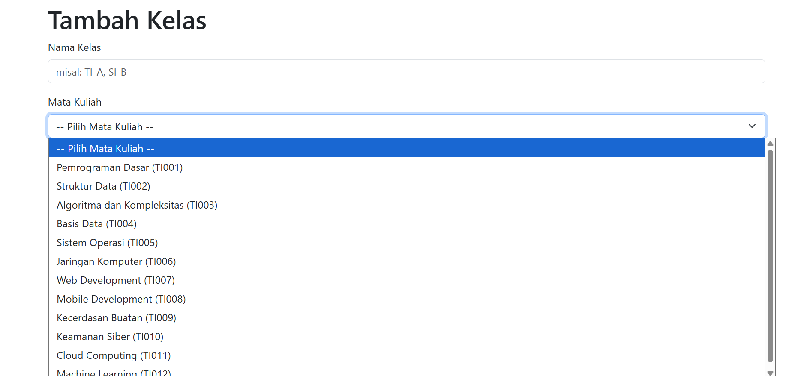
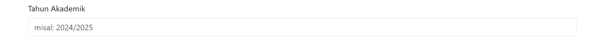

# Analisis Fitur "Kelas" dan "Peserta Kelas" pada Web Absensi


Pada artikel ini kita akan menelusuri struktur dari fitur "Kelas" dan "Peserta Kelas" yang ada dalam aplikasi Web Absensi. Update yang diterapkan kali ini membawa beberapa perkembangan yang sebelumnya belum pernah diimplementasikan pada fitur-fitur lainnya. Oleh karena itu, ikuti artikel ini sampai habis dan lihat apa saja yang bisa kita pelajari untuk pengembangan selanjutnya!

## Daftar Isi

1. [Gambaran Umum Fitur](#gambaran-umum-fitur)
2. [Alur Pengolahan Data](#alur-pengolahan-data)
3. [Analisis Arsitektur MVC](#analisis-arsitektur-mvc)
4. [Evaluasi](#evaluasi)

### Extras

- [Helper Functions]()
- [Database Seeding]()

### [Akhir Kata](#akhir-kata-1)

## Gambaran Umum Fitur

Fitur "Kelas" dan "Peserta Kelas" menyatukan dua jenis data yang berbeda namun masih saling berhubungan dalam satu paket fitur yang utuh, sesuatu yang belum diimplementasikan pada program sebelumnya, mengingat bahkan fitur "Pengguna" masih diimplementasikan secara terpisah antara satu jenis pengguna dengan jenis lainnya. Secara umum, fitur ini memiliki fungsi yang sama seperti fitur-fitur sebelumnya. Pengguna dapat menambah, mengedit, menghapus, serta melihat data kelas serta peserta kelas. Halaman-halaman yang ditampilkan juga masih identik, terdapat halaman **List Kelas** untuk menampilkan semua kelas yang tersimpan, halaman **Tambah Kelas** untuk menambahkan data kelas yang baru, halaman **Edit Kelas** untuk mengedit data kelas yang sudah dibuat sebelumnya, serta terdapat fitur **Hapus Kelas** untuk menghapus data kelas yang sudah dibuat.


Dari segi tampilan, tidak banyak yang berubah. Namun dari segi fungsi, ada beberapa fungsi yang mungkin belum familiar bagi kita, dan fungsi ini dapat dikatakan sebagai *step-up* yang meningkatkan kualitas pengalaman penggunaan Web Absensi.

### Memilih data yang sudah ada



Jika sebelumnya input data hanya dilakukan dengan pengetikan manual, di sini input data dapat dilakukan dengan memilih data yang sudah ada melalui fungsi **Dropdown**. Mengingat bahwa fitur ini mengadopsi banyak data dari fitur-fitur sebelumnya seperti **Mahasiswa**, **Dosen**, dan **Mata Kuliah**, maka fitur pemilihan ini merupakan pendekatan yang sangat tepat untuk menghindari input data yang keliru (tidak sesuai dengan data yang sudah ada) sekaligus memudahkan pengguna dalam menentukan pilihan, tanpa perlu mengetiknya secara manual dan bebas dari resiko kesalahan.

### Checkbox dan filter data


Sebelumnya pengguna hanya dapat input data tunggal untuk setiap field. Untuk beberapa jenis data, metode input ini sangat tidak efektif karena menimbulkan proses yang repetitif dan melelahkan. Salah satu pendekatan yang dapat mengatasi masalah tersebut adalah input tipe **Checkbox**. Proses input dengan tipe ini mampu menyederhanakan proses yang sebelumnya repetitif dan cenderung memakan waktu. Penggunaan Checkbox pada fitur ini merupakan langkah cerdas untuk memasukkan lebih dari satu mahasiswa sekaligus ke dalam satu kelas yang sama. Bahkan fitur ini telah dilengkapi dengan fungsi filter yang semakin memudahkan dan mempercepat pemilihan data dengan kategori yang lebih spesifik.

### Placeholder



Sebuah sentuhan tambahan yang sederhana dan jarang digubris namun sangat membantu pengguna dalam menginput data, benda ini bernama **Placeholder**. Tampilannya sederhana, tidak mencolok, menggunakan warna yang lebih samar agar dapat dibedakan dengan value input yang sebenarnya, namun kehadirannya sangat berguna dalam memastikan format input pengguna yang tepat dan tidak ambigu. Seringkali pengisian data mengalami ambiguitas karakteristik data karena kurangnya instruksi yang memandu pengguna untuk memasukkan data dengan format yang sesuai. Kehadiran Placeholder menyelesaikan persoalan yang sepele namun menyebalkan tersebut.


Dari segi Database, fitur ini terikat dengan dua tabel yang berbeda, yaitu tabel **Kelas** dan **Peserta Kelas**. Penerapannya secara garis besar identik dengan fitur **Pengguna** yang telah dikembangkan sebelumnya, di mana beberapa tabel dibutuhkan saling berhubungan sehingga tercipta *Relationship* antar tabel yang terkait. Namun pada fitur ini, penerapannya akan menghadapi kompleksitas yang sedikit lebih memusingkan, namun semua akan dikupas perlahan pada bagian-bagian berikutnya dalam artikel ini.

## Alur Pengolahan Data

Data yang berlalu-lalang dalam fitur ini tetap mengikuti alur yang sama seperti fitur-fitur sebelumnya. Sederhananya, ketika pengguna berinteraksi dengan aplikasi Web Absensi, baik itu membuka sebuah halaman, menekan tombol untuk menambah data baru, menekan tombol untuk menyimpan data, dan sebagainya, server akan menerimanya sebagai "request" dan melakukan "routing" untuk mengambil data, mengolah data, serta mengeksekusi perintah yang sesuai, lalu memberikan "respon" kepada pengguna melalui tampilan halaman ataupun eksekusi perintah tergantung pada program yang diterapkan pengguna. Aplikasi Web Absensi menggunakan konsep MVC, artinya data mengalir melalui tiga komponen berbeda yang memiliki perannya masing-masing, yaitu **Model**, **View**, dan **Controller**. Penjelasan lengkap ketiga komponen ini akan dipaparkan pada bagian selanjutnya. Dengan pendekatan konsep ini, request pengguna akan dirouting menuju perintah yang tepat dari Controller, lalu Controller akan berinteraksi dengan Model untuk mengambil, menyimpan, atau mengubah data, serta menampilkannya dengan bantuan View. Model akan berinteraksi dengan database agar memperoleh data yang nantinya akan diperlukan oleh Controller dan ditampilkan oleh View. Ketiganya berjalan beriringan agar data dapat mengalir dari pengguna ke server sampai kembali lagi ke pengguna.


## Analisis Arsitektur MVC

Pada dasarnya arsitektur MVC dalam fitur ini masih selaras dengan fitur-fitur sebelumnya, namun terdapat beberapa tambahan perintah yang lebih kompleks dan memperkaya fungsi dari fitur satu ini, termasuk beberapa fungsi bantu (*Helper Function*) yang akan dibahas pada bagian tersendiri nantinya. Pada bagian ini, fungsi-fungsi yang sudah pernah digunakan akan dilewati, jadi hanya beberapa fungsi yang belum ada sebelumnya yang akan dibahas.

### MODEL - Kelas.js

```javascript
function ambilSemuaKelas() {
    return db.prepare(`
        SELECT 
            kelas.id,
            kelas.mata_kuliah_id,
            kelas.dosen_id,
            kelas.nama_kelas,
            kelas.semester,
            kelas.tahun_akademik,
            mata_kuliah.nama as nama_mata_kuliah,
            mata_kuliah.kode as kode_mata_kuliah,
            pengguna.nama as nama_dosen,
            pengguna.email as email_dosen,
            COUNT(peserta_kelas.id) as jumlah_peserta
        FROM kelas
        JOIN mata_kuliah ON kelas.mata_kuliah_id = mata_kuliah.id
        JOIN dosen ON kelas.dosen_id = dosen.id
        JOIN pengguna ON dosen.pengguna_id = pengguna.id
        LEFT JOIN peserta_kelas ON kelas.id = peserta_kelas.kelas_id
        GROUP BY kelas.id
        ORDER BY kelas.tahun_akademik DESC, kelas.semester DESC, kelas.nama_kelas ASC
    `).all();
}
```

Penggalan kode ini memasukkan perintah SQL yang belum pernah digunakan sebelumnya seperti ```LEFT JOIN``` dan ```GROUP``` yang berfungsi untuk menyatukan dua tabel berdasarkan nilai tertentu dengan tetap mempertahankan semua baris bahkan yang tidak memiliki pasangan di tabel lainnya. Selanjutnya adalah ```COUNT``` yang merupakan perintah untuk menghitung banyak data dari nilai yang dipilih dan menyimpannya dalam satu data baru. Terakhir adalah perintah ```ORDER BY``` untuk mengurutkan data berdasarkan nilai tertentu dengan urutan ```ASC```ending atau ```DESC```ending.

### MODEL - PesertaKelas.js

```javascript
function setBulkPesertaKelas(kelas_id, mahasiswa_ids_array) {
    // Delete all existing enrollments for this class
    hapusPesertaKelasByKelasId(kelas_id);
    
    // Insert new enrollments if array is not empty
    if (mahasiswa_ids_array && mahasiswa_ids_array.length > 0) {
        const stmt = db.prepare(`INSERT INTO peserta_kelas (mahasiswa_id, kelas_id) VALUES (?, ?)`);
        mahasiswa_ids_array.forEach(mahasiswa_id => {
            stmt.run(mahasiswa_id, kelas_id);
        });
    }
}
```

Satu blok fungsi ini pada dasarnya adalah perintah untuk menyimpan data mahasiswa secara *Bulk* atau dalam jumlah yang banyak. Jika diingat kembali, pengguna dapat menginput lebih dari satu mahasiswa untuk masuk dalam satu kelas, oleh sebab itu diperlukan mekanisme khusus untuk menangani data plural seperti ini. Sederhananya, saat perintah ini dijalankan, data peserta kelas yang telah tersimpan sebelumnya di Database akan dihapus terlebih dahulu, lalu data kembali dimasukkan ke Database bersama dengan data-data baru melalui manipulasi Array.

### VIEW - create.hbs

```hbs
{{#each mataKuliah}}
    <option value="{{id}}" {{isSelected id ../formData.mata_kuliah_id}}>
        {{nama}} ({{kode}})
    </option>
{{/each}}
```

Penggalan kode ini merupakan perintah untuk menampilkan option berdasarkan data yang ada pada ```mataKuliah``` dan menandai "selected" pada data yang memenuhi syarat fungsi ```isSelected``` (selengkapnya tentang *Helper Function* ini akan dipaparkan pada bagian berikutnya).

```hbs
{{#each mahasiswa}}
    <div class="form-check mahasiswa-item" data-angkatan="{{angkatan}}" data-program-studi="{{program_studi}}">
        <input class="form-check-input" type="checkbox" id="mahasiswa_{{id}}" name="peserta_mahasiswa" value="{{id}}"
            {{isChecked ../peserta_mahasiswa_selected id}}>
        <label class="form-check-label" for="mahasiswa_{{id}}">
            {{nama}} ({{nim}}) - {{program_studi}} {{angkatan}}
        </label>
    </div>
{{/each}}
```

Penggalan kode tersebut akan menampilkan daftar mahasiswa yang dapat dipilih disertai dengan mekanisme pengecekan Checkbox bernama ```isChecked``` yang merupakan salah satu *Helper Function*.

```hbs
<!-- Filter by Angkatan and Program Studi -->
    <div class="row mb-2">
      <div class="col-md-6">
        <label for="filterAngkatan" class="form-label small">Filter Angkatan</label>
        <select class="form-select form-select-sm" id="filterAngkatan">
          <option value="">-- Semua Angkatan --</option>
          {{#each angkatanList}}
          <option value="{{this}}">{{this}}</option>
          {{/each}}
        </select>
      </div>
      <div class="col-md-6">
        <label for="filterProgramStudi" class="form-label small">Filter Program Studi</label>
        <select class="form-select form-select-sm" id="filterProgramStudi">  
          <option value="">-- Semua Program Studi --</option>
          {{#each programStudiList}}
          <option value="{{this.value}}">{{this.label}}</option>
          {{/each}}
        </select>
      </div>
    </div>
```

```html
<script>
function applyFilters() {
    const angkatanFilter = document.getElementById('filterAngkatan').value;
    const programStudiFilter = document.getElementById('filterProgramStudi').value;
    const mahasiswaItems = document.querySelectorAll('.mahasiswa-item');
    
    mahasiswaItems.forEach(item => {
        const angkatan = item.getAttribute('data-angkatan');
        const programStudi = item.getAttribute('data-program-studi');
        
        const angkatanMatch = !angkatanFilter || angkatan === angkatanFilter;
        const programStudiMatch = !programStudiFilter || programStudi === programStudiFilter;
        
        if (angkatanMatch && programStudiMatch) {
            item.style.display = 'block';
        } else {
            item.style.display = 'none';
        }
    });
}

document.getElementById('filterAngkatan').addEventListener('change', applyFilters);
document.getElementById('filterProgramStudi').addEventListener('change', applyFilters);
</script>
```

Kedua penggalan tersebut merupakan satu kesatuan perintah untuk menerapkan fungsi filter pilihan. Pilihan yang ditampilkan pada dropdown filter adalah data yang tercatat dalam list masing-masing jenis data, lalu fungsi filter diimplementasikan pada bagian script setelahnya, yang mana fungsi ```applyFilters``` dikaitkan dengan tombol filter yang telah dibuat sebelumnya dan akan tereksekusi apabila terjadi perubahan pada pilihan dropdown.

### VIEW - edit.hbs

Secara garis besar memiliki isi yang sama dengan ```create.hbs```, hanya saja pada bagian ini data-data yang telah diisi akan tercantum pada setiap field agar pengguna dapat langsung mengeditnya, sebuah hal yang sebenarnya sudah diterapkan juga pada bagian sebelumnya untuk menerapkan *Error Handling*.

### VIEW - list.hbs

Tidak ada perbedaan yang mencolok dibandingkan tampilan pada fitur-fitur lainnya. Pada fitur ini, data yang ditampilkan adalah nama kelas, mata kuliah, dosen, semester, tahun akademik, serta jumlah peserta yang diperoleh dari perintah langsung pada Database menggunakan SQL (```COUNT```) untuk menghitung banyak mahasiswa yang dipilih (Checkboxnya dicentang).

### CONTROLLER - KelasController.js

```javascript
const PROGRAM_STUDI_MAP = {
    'ti': { value: 'ti', label: 'Teknik Informatika (TI)' },
    'it': { value: 'it', label: 'Teknologi Informasi (IT)' },
    'si': { value: 'si', label: 'Sistem Informasi (SI)' }
};
```

```javascript
function mapProgramStudiList(programStudiCodes) {
    return programStudiCodes.map(code => PROGRAM_STUDI_MAP[code] || { value: code, label: code }).sort((a, b) => a.label.localeCompare(b.label));
};
```

Penggalan perintah ini berfungsi untuk melakukan Mapping pada List Program Studi agar dapat menyesuaikan antara label yang merupakan nama panjang dari Program Studi dengan nilai dari setiap Program Studi tersebut.

```javascript
if (!tahun_akademik || tahun_akademik.trim() === '') {
    pesanError.push("Tahun akademik tidak boleh kosong");
} else if (!/^\d{4}\/\d{4}$/.test(tahun_akademik.trim())) {
    pesanError.push("Format tahun akademik harus YYYY/YYYY (misal: 2024/2025)");
} else {
    const years = tahun_akademik.trim().split('/');
    const year1 = parseInt(years[0]);
    const year2 = parseInt(years[1]);
    if (year2 !== year1 + 1) {
        pesanError.push("Tahun akademik tidak valid (tahun kedua harus tahun pertama + 1)");
    }
    if (year1 < 2000 || year1 > 2100) {
        pesanError.push("Tahun akademik tidak valid (harus antara 2000 dan 2100)");
    }
}
```

Penggalan kode ini merupakan salah satu *Error Validation* yang cukup menarik, terutama pada bagian berikut:

```javascript
const years = tahun_akademik.trim().split('/');
const year1 = parseInt(years[0]);
const year2 = parseInt(years[1]);
if (year2 !== year1 + 1) {
    pesanError.push("Tahun akademik tidak valid (tahun kedua harus tahun pertama + 1)");
}
```

Format tahun akademik yang tepat adalah ```tahun/tahun+1```. Validasi ini diawali dengan memisahkan kedua tahun tersebut menggunakan ```Split``` dan memasukkannya ke dalam array ```years```, lalu melakukan pengecekan antara keduanya agar mendeteksi error jika tahun kedua bukan satu tahun setelah tahun pertama.

```javascript
if (!pesanError.length && mata_kuliah_id && semester && tahun_akademik) {
    const existingKelas = KelasModel.ambilSemuaKelas().find(k => 
        k.mata_kuliah_id === parseInt(mata_kuliah_id) &&
        k.semester === semester.trim() &&
        k.tahun_akademik === tahun_akademik.trim() &&
        (!kelas_id_untuk_edit || k.id !== parseInt(kelas_id_untuk_edit))
    );

    if (existingKelas) {
        pesanError.push("Kombinasi mata kuliah, semester, dan tahun akademik sudah ada");
    }
}
```

Penggalan kode ini juga merupakan pendekatan *Error Validation* yang menarik karena melakukan pengecekan pada tiga komponen yang berbeda secara bersamaan untuk memastikan tidak ada kombinasi yang sama persis. Jika terdapat kombinasi yang sama persis maka artinya sudah ada kelas yang sama sebelumnya, dengan demikian sebuah error harus dinyatakan agar tidak terjadi duplikasi data.

```javascript
// Extract unique angkatan and program_studi for filter dropdowns
const angkatanSet = new Set(mahasiswa.map(m => m.angkatan));
const programStudiSet = new Set(mahasiswa.map(m => m.program_studi));
const angkatanList = Array.from(angkatanSet).sort((a, b) => b - a);
const programStudiList = mapProgramStudiList(Array.from(programStudiSet));
```

Penggalan kode ini merupakan perintah yang cukup kompleks dengan tujuan yang cukup sederhana, yaitu menambah data angkatan-angkatan dan program studi apa saja yang telah tercatat ke dalam data, sehingga data ini dapat digunakan untuk fungsi filter nantinya, mengingat pilihan pada fungsi filter bergantung pada data angkatan dan program studi yang sudah tercatat dalam Database.

```javascript
// Set peserta kelas (bulk assign students)
const mahasiswa_ids = Array.isArray(peserta_mahasiswa) ? peserta_mahasiswa.map(id => parseInt(id)) : [];
PesertaKelasModel.setBulkPesertaKelas(kelas_id, mahasiswa_ids);
```

Penggalan kode tersebut menjadi kelanjutan penerapan dari fungsi penyimpanan data *Bulk* mahasiswa pada Model ```PesertaKelas.js``` sebelumnya.

### Router - kelasRoutes.js

Secara keseluruhan tidak ada yang berbeda dari bagian ini dibandingkan fitur-fitur sebelumnya, sebab dari segi fungsi secara umum fitur ini masih sama dengan yang lainnya.

## Evaluasi

Secara keseluruhan, implementasi perintah dan fungsi pada fitur "Kelas" dan "Peserta Kelas" menawarkan sangat banyak kemudahan terhadap pengguna, mulai dari fungsi yang memudahkan pencarian data, penginputan data, sampai penjaminan keamanan dan kenyamanan penggunaan aplikasi. Pengguna dapat merasa lebih nyaman menggunakan aplikasi yang mengutamakan kemudahan, kepraktisan, serta kesederhanaan bahkan dalam penggunaan fungsi dengan kompleksitas tinggi. Jika dipandang dari balik layar, kode program untuk fitur ini bisa terbilang cukup kompleks dengan banyaknya penggunaan *Array Mapping* hingga *Set* yang memerlukan upaya lebih untuk memahaminya. Namun seluruh kompleksitas di balik layar tersebut berhasil menyuguhkan kemudahan dan kenyamanan bagi pengguna.

## EXTRAS - Helper Functions

Beberapa fungsi sederhana justru menjadi *Game Changer* apabila diterapkan dengan konteks dan kondisi yang tepat. Berikut beberapa *Helper Function* yang membantu penyederhanaan kompleksitas dari fungsi pada fitur "Kelas" dan "Peserta Kelas":

```javascript
inc: (value) => parseInt(value) + 1
```

```Bertindak sebagai incrementor (menambah nilai dengan 1), fungsi yang sepele namun sangat membantu dalam penamaan nilai yang masih terikat pada indeks (dimulai dari 0)```

```javascript
isSelected: (a, b) => { return String(a) === String(b) ? 'selected' : ''; }
```

```Bertindak sebagai inspektor, mengembalikan nilai "Selected" apabila kondisi nilai terpenuhi, digunakan untuk pengecekan pada input tipe "Dropdown"```

```javascript
isChecked: (arr, val) => {
    if (!arr) return '';
    const arrValues = arr.map(v => String(v));
    return arrValues.includes(String(val)) ? 'checked' : '';
}
```

```Bertindak sebagai inspektor, mengembalikan nilai "Checked" apabila nilai terdapat pada Array, digunakan untuk pengecekan pada input tipe "Checkbox"```

```javascript
eq: function(a, b, options) {
    const isEqual = String(a) === String(b);
    if (options && typeof options.fn === 'function') {
    return isEqual ? options.fn(this) : options.inverse(this);
    } else {
    return isEqual;
    }
}
```

```Bertindak sebagai block helper dan inline helper dalam konteks data tunggal (membandingkan dua data)```

```javascript
inArray: function(arr, val, options) {
    if (!arr) {
    if (options && typeof options.fn === 'function') {
        return options.inverse(this);
    }
    return false;
    }
    const arrValues = arr.map(v => String(v));
    const isIncluded = arrValues.includes(String(val));
    if (options && typeof options.fn === 'function') {
    return isIncluded ? options.fn(this) : options.inverse(this);
    } else {
    return isIncluded;
    }
}
```

```Bertindak sebagai block helper dan inline helper dalam konteks Array```

## EXTRAS - Database Seeding

Menambahkan data satu per satu ke dalam Database adalah kegiatan yang super membosankan. Bagi orang-orang yang tidak tahan bosan, *Database Seeding* adalah solusi yang tepat. Metode ini dapat dilakukan untuk memasukkan data-data aktual maupun *dummy* ke dalam Database sebelum benar-benar menjalankan program. Metode seeding ini telah diterapkan dalam pengembangan aplikasi Web Absensi melalui ```seeder.js```. Sederhananya, metode ini mengganti proses penginputan data manual dengan program yang ketika dijalankan akan secara simultan memasukkan data-data yang diprogram ke dalam Database. Cara ini dapat menghemat cukup banyak waktu dibandingkan harus memasukkan data satu per satu menggunakan fitur "Tambah Data" yang sebenarnya. Sebuah permasalahan yang lagi-lagi sepele, namun mampu menyelamatkan seseorang dari lingkaran kebosanan.

## Akhir Kata

Secara pribadi, saya kembali tersadar akan banyaknya fungsi, metode, dan pendekatan yang masih sangat tidak familiar di pemahaman saya. Ada banyak hal baru yang menunggu hingga diri kita sendiri yang bergerak cukup jauh untuk mencarinya. Apapun itu, mari terus mencari tahu. Sampai bertemu di pembahasan berikutnya.


[Kembali ke Halaman Utama](./index.md)

atau [Kembali ke Paling Atas](#analisis-fitur-kelas-dan-peserta-kelas-pada-web-absensi)